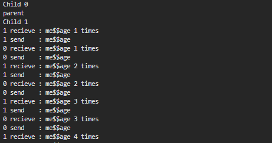
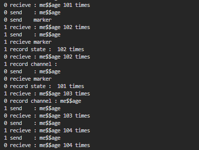

# 全局快照算法

## 代码说明

主函数位于 `process.cpp`， 程序会 fork 2 个子进程， 2 个进程之间使用 linux 的接口 pipe 通信。

程序记录的状态位于 `state.hpp` ， 状态会记录收到消息的次数和此时存储的消息， 如果消息为空则表示此时没有存储消息。

## 运行

编译

```
g++ ./process.cpp -o out -pthread -std=c++11
```

运行

```
./out
```

## 功能展示



程序启动后会 fork 2 个子进程， 它们之间不断轮转消息， 消息为 `me$$age`， log 里打印出 2 个进程收到消息的次数



0 号进程收到第 101 次消息时， 发送消息， 并马上启动快照算法， 发送 `marker` 消息。

1 号进程收到 `marker` 后， 记录自己的状态， 并记录 0 到 1 号的信道。

随后 1 号进程发送 `marker` 

0 号进程收到  `marker`  后结束快照算法， 记录下自己的状态和 1 到 0 号的信道。

最终两个进程记录的状态为：

```
1 record state :  102 times
1 record channel :

0 record state :  101 times
0 record channel : me$$age
```

表明 1 号进程记录的状态为 102， 0 号进程记录的状态为 101， 并且 0 到 1 号的信道没有记录消息， 1 到 0 号的信道记录下消息 `me$$age`。 这与我们的推演一致。 